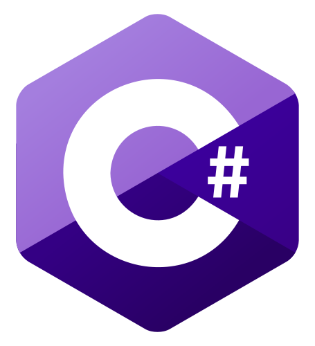

## Hi there I'm Timo👋

Aktuell bin ich im dritten Lehrjahr und am Anfang des 6. Semesters der <b><a href="https://www.fom.de">FOM</b></a> in Essen. Nachdem ich mein Abitur 2018 beendet habe, öffnete sich wie für viele andere auch, ein neuer Lebensweg. Wohin die Richtung geht, konnte ich nur erahnen. Als ich mein duales Studium begonnen habe wuchs meine Leidenschaft für Technik. Seit dem beschäftige ich mich immer mehr mit Softwareentwicklung und allen Bereichen der Informatik.

- 👨‍🎓 Student 
- 💻 Programmer 
- 🕹 Gamer 

## Programming Languages

         


```console
$ neofetch
                                                            
                    %(((((((((((/(((((((((#                     timo@gremi-jr
                (((((((((                   (((                 --------------
             (((/(((#                           #(              Uptime: 22 Jahre
           ((((((%                                 (%           Editor: VS Code
         ((((((                                      #          Shell: zsh
       %((((((                                         #        OS: macOS/Ubuntu
      ((/(((            ((((          &(/(#                     
     #(((((&        (((((((          (((((((((#                 contact
     ((((((     (((((((           %(((((   #((((((%             --------------
    &(((((& (((((((&            ((((((         #((((((#         Discord: ToXii_ | Timo#5459
    &((((( ((((((             ((/(((              ((((((        Mail: timo@timogremler.de
    &(((((#   (((((((       (((((#            (((((((&          Website: timogremler.de
     ((((((       ((((((( (((((%          (((((((&              Github: gremi-jr
     #(((((&          (((((((%         ((((((               
      ((/(((&                           #                   
       &((((((                                         (    
         (((((((                                     %      
           (((((((                                 (        
             #((/((((                           ((          
                &(((((((((                 (((#             
                     #((((((((((/(((((((((                  
                                                            
                                                                            
                   
```                                                                                

```console
$ stats

languages                 tools
---------                 ---------
C# [x]                    Git [x] 
PowerShell [x]            GitHub [x]
Python [x]                Jira [x]
Java [x]                  Confluence [x]
SQL [x]                   Bitbucket [x]
HTML/CSS [x]              Grafana [x]
```

                                                            

